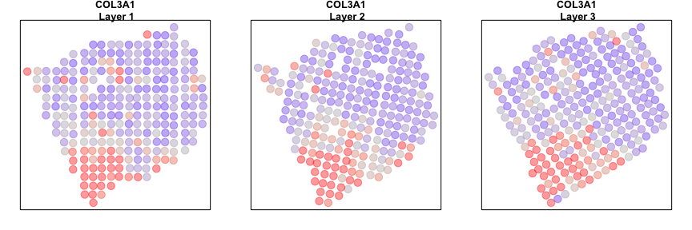
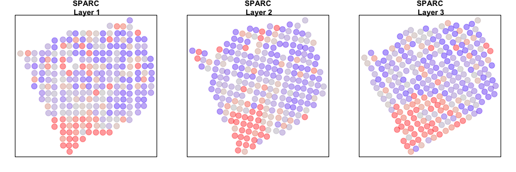
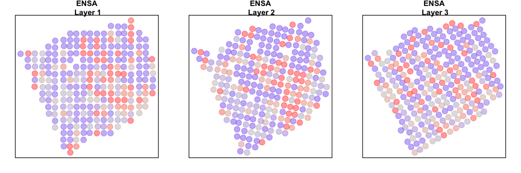

In this vignette, we will walk through an analysis of spatial
transcriptomics data for multiple consecutive tissue slices of a breast
cancer biopsy. Briefly, for spatial transcriptomics, histological
sections are placed on a grid of poly(dT) probe spots approximately 100
um in diameter, each with a unique DNA barcode. By resolving the DNA
barcodes, spatial transcriptomics enables matching of detected mRNA
abundances with their original spatially resolved spot, resulting in
full transcriptome RNA-sequencing data with homogenously-spaced
two-dimensional positional information at the pixel level. See the
[original
publication](http://science.sciencemag.org/content/353/6294/78) for more
information.

The data has been prepared for you and is available as a part of the
package. Here, each dataset is a list containing two items: `pos` is a
dataframe where each row is a probe spot’s x and y positions in space,
and `counts` is a counts matrix where each column is a probe spot and
each row is a gene.

Although a total of 4 tissue layers are available, we will focus on
analyzing 3 tissue layers for demonstrative purposes.

``` r
suppressMessages(library(MERingue))

data(BCL1) # layer 1
data(BCL2) # layer 2
data(BCL3) # layer 3

## Additional layers not used in this demonstration but available in the package
#data(BCL4) # layer 4
```

We will first combine the data from all four samples into a single
counts matrix. We will also combine the position information into a list
of positions.

``` r
# Get common set of genes
genes.have <- Reduce(intersect, list(
  rownames(BCL1$counts),
  rownames(BCL2$counts),
  rownames(BCL3$counts)
))
# Combine into large counts matrix
counts <- cbind(
  BCL1$counts[genes.have,],
  BCL2$counts[genes.have,],
  BCL3$counts[genes.have,]
)
# Unique names based on layers
colnames(counts) <- c(
  paste0('L1-', colnames(BCL1$counts)),
  paste0('L2-', colnames(BCL2$counts)),
  paste0('L3-', colnames(BCL3$counts))
)
# Layer factor
layer <-  c(
  rep('L1', ncol(BCL1$counts)),
  rep('L2', ncol(BCL2$counts)),
  rep('L3', ncol(BCL3$counts))
)
names(layer) <- colnames(counts)
# List of positions
posList <- list(
  BCL1$pos[colnames(BCL1$counts),],
  BCL2$pos[colnames(BCL2$counts),],
  BCL3$pos[colnames(BCL3$counts),]
)
rownames(posList[[1]]) <- paste0('L1-', rownames(posList[[1]]))
rownames(posList[[2]]) <- paste0('L2-', rownames(posList[[2]]))
rownames(posList[[3]]) <- paste0('L3-', rownames(posList[[3]]))
```

We will then filter out genes with fewer than 100 counts across all
probe spots and filter out probe spots with fewer than 100 total counts
and update our position information accordingly.

``` r
cc <- cleanCounts(counts, min.reads = 100, min.lib.size = 100, plot=TRUE)
```


``` r
mat <- normalizeCounts(cc, log=FALSE, verbose=TRUE)
```

    ## Normalizing matrix with 767 cells and 4985 genes.

    ## normFactor not provided. Normalizing by library size.

    ## Using depthScale 1e+06

``` r
posList[[1]] <- posList[[1]][intersect(rownames(posList[[1]]), colnames(mat)),]
posList[[2]] <- posList[[2]][intersect(rownames(posList[[2]]), colnames(mat)),]
posList[[3]] <- posList[[3]][intersect(rownames(posList[[3]]), colnames(mat)),]
```

Now, let’s visualize the probe spots for each layer. For demonstrative
purposes, we will look for evidence of significant spatial aggregation
for 1000 randomly chosen genes.

``` r
# Plot
par(mfrow=c(1,3), mar=rep(2,4))
plotEmbedding(posList[[1]], groups=layer, main='Layer 1', cex=2)
plotEmbedding(posList[[2]], groups=layer, main='Layer 2', cex=2)
plotEmbedding(posList[[3]], groups=layer, main='Layer 3', cex=2)
```


``` r
# Sample 1000 genes for demonstrative purposes only
set.seed(0)
test <- sample(rownames(mat), 1000)
mat <- mat[test,]
```

Individual layer analysis
=========================

Now, we can analyze each layer separately to look for significantly
spatially aggregated genes. For each layer, we will construct a binary
weight matrix that represents the spatial adjacency relationship between
probe spots. We will then look for significantly spatially aggregated
genes driven by more than 5% of probe spots.

``` r
helper <- function(pos, mat) {
  w <- voronoiAdjacency(pos, filterDist = 3, plot=TRUE)
  # get spatially clustered genes
  I <- getSpatialPatterns(mat, w)
  # filter for significant hits driven by more than 10% of cells
  results.filter <- filterSpatialPatterns(mat = mat,
                                          I = I,
                                          w = w,
                                          adjustPv = TRUE,
                                          alpha = 0.05,
                                          minPercentCells = 0.05,
                                          verbose = TRUE)
  # return results
  list(I=I, sig.genes=results.filter)
}

# Analyze each layer using helper function
par(mfrow=c(1,3), mar=rep(2,4))
L1 <- helper(posList[[1]], mat[, rownames(posList[[1]])])
```

    ## Number of significantly autocorrelated genes: 80

    ## ...driven by > 12.7 cells: 33

``` r
L2 <- helper(posList[[2]], mat[, rownames(posList[[2]])])
```

    ## Number of significantly autocorrelated genes: 98

    ## ...driven by > 12.5 cells: 47

``` r
L3 <- helper(posList[[3]], mat[, rownames(posList[[3]])])
```

    ## Number of significantly autocorrelated genes: 65

    ## ...driven by > 13.15 cells: 28


Multi-layer analysis
====================

We can also specifically look for spatially aggregated genes that with
patterns that are consistent across layers. To do this, we will create a
new binary weight matrix that specially connects probe spots across
adjacent tissue layers. Two probe spots will have a weight of 1 if they
are within the 5 mutual nearest neighbors in space across two layers. We
can then use this new binary weight matrix to identify spatially
aggregated genes that are aggregated across layers.

``` r
# K-mutual nearest neighbors across layers
cw <- getCrossLayerNeighbors(posList, k=3)
# Look for genes exhibiting spatial autocorrelation across layers
I <- getSpatialPatterns(mat, cw)
results.filter <- filterSpatialPatterns(mat = mat,
                                        I = I,
                                        w = cw,
                                        adjustPv = TRUE,
                                        alpha = 0.05,
                                        minPercentCells = 0.05/4,
                                        verbose = TRUE)
```

    ## Number of significantly autocorrelated genes: 84

    ## ...driven by > 9.5875 cells: 78

``` r
cross <- list(I=I, sig.genes=results.filter)
```

We can now compare our results from our individual sample analyses and
our cross sample analyses. Let’s look at a few genes that are
significantly aggregated within multiple layers AND consistent across
layers.

``` r
gdups <- unlist(list('L1'=L1$sig.genes, 
                     'L2'=L2$sig.genes, 
                     'L3'=L3$sig.genes
))
gdups <- gdups[duplicated(gdups)]
gcross <- cross$sig.genes
gall <- intersect(gcross, gdups)
gall <- gall[order(L1$I[gall,]$observed, decreasing=TRUE)]

# Plot consistent gene
invisible(lapply(gall[1:2], function(g1) {
  par(mfrow=c(1,3), mar=rep(2,4))
  plotEmbedding(posList[[1]], 
                colors=scale(mat[g1, rownames(posList[[1]])])[,1], 
                main=paste0(g1, '\n Layer 1'),
                cex=2, zlim=c(-1,1), verbose=FALSE)
  plotEmbedding(posList[[2]], 
                colors=scale(mat[g1, rownames(posList[[2]])])[,1], 
                main=paste0(g1, '\n Layer 2'), 
                cex=2, zlim=c(-1,1), verbose=FALSE)
  plotEmbedding(posList[[3]], 
                colors=scale(mat[g1, rownames(posList[[3]])])[,1], 
                main=paste0(g1, '\n Layer 3'), 
                cex=2, zlim=c(-1,1), verbose=FALSE)
}))
```



Alternatively, we can look at genes that are spatially aggregated within
multiple layers but not in a manner that is consistent across layers.
Such inconsistent patterns may be indicative of layer-specific
structures or technical artefacts.

``` r
gdiff <- setdiff(gdups, gcross)
gdiff <- gdiff[order(L1$I[gdiff,]$observed, decreasing=TRUE)]

# Plot consistent gene
invisible(lapply(gdiff[1:2], function(g1) {
  par(mfrow=c(1,3), mar=rep(2,4))
  plotEmbedding(posList[[1]], 
                colors=scale(mat[g1, rownames(posList[[1]])])[,1], 
                main=paste0(g1, '\n Layer 1'),
                cex=2, zlim=c(-1,1), verbose=FALSE)
  plotEmbedding(posList[[2]], 
                colors=scale(mat[g1, rownames(posList[[2]])])[,1], 
                main=paste0(g1, '\n Layer 2'), 
                cex=2, zlim=c(-1,1), verbose=FALSE)
  plotEmbedding(posList[[3]], 
                colors=scale(mat[g1, rownames(posList[[3]])])[,1], 
                main=paste0(g1, '\n Layer 3'), 
                cex=2, zlim=c(-1,1), verbose=FALSE)
}))
```



Additional exercises
====================

1.  Integrate the 4th tissue layer.
2.  What primary spatial patterns are marked by genes consistent across
    layers?
3.  What primary spatial patterns are marked by genes inconsistent
    across layers?
