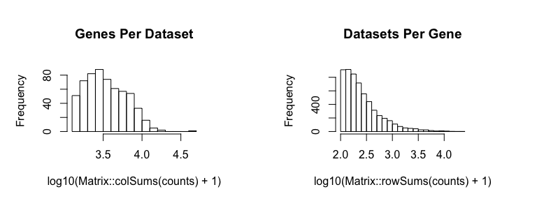
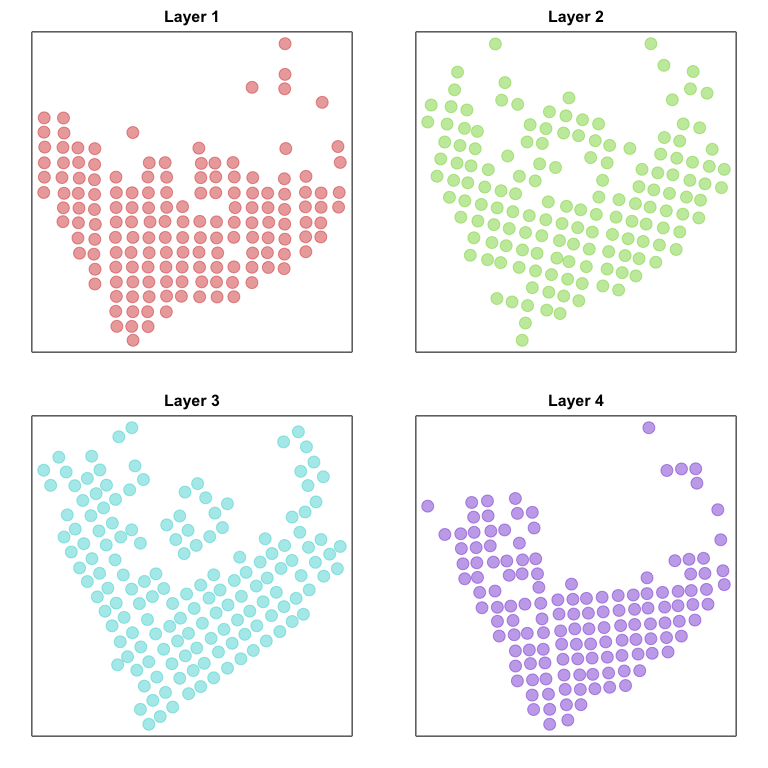
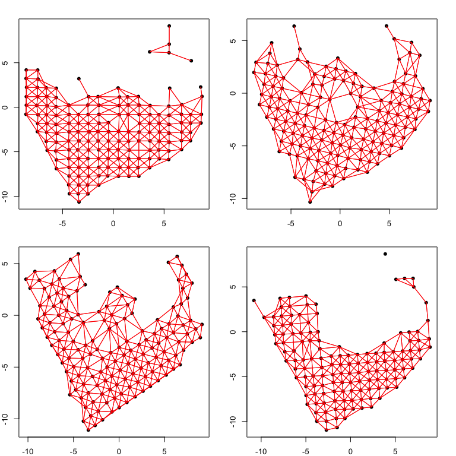
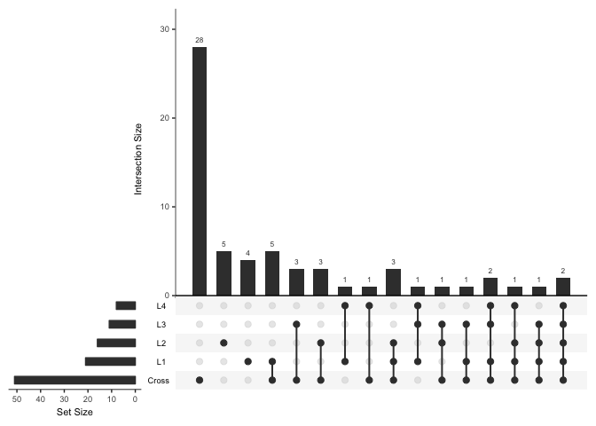
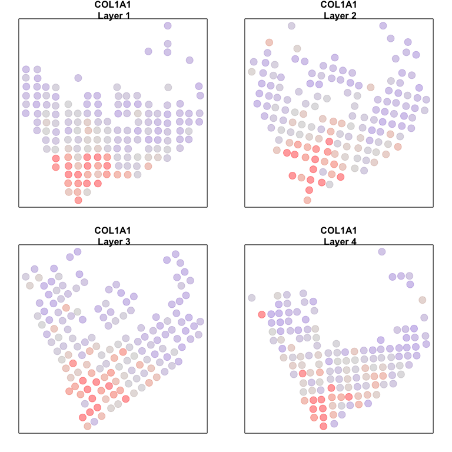

# 3D Breast Cancer Spatial Transcriptomics Analysis with MERingue

In this vignette, we will walk through an analysis of spatial
transcriptomics data for 4 consecutive tissue slices of a breast cancer
biopsy. The data has been prepared for you and is available as a part of
the package. Here, each dataset is a list containing two items: `pos` is
a dataframe where each row is a voxel’s x and y positions in space, and
`counts` is a counts matrix where each column is a voxel and each row is
a gene.

``` r
library(MERingue)
data(BCL1) # layer 1
data(BCL2) # layer 2
data(BCL3) # layer 3
data(BCL4) # layer 4
```

We will first combine the data from all four samples into a single
counts matrix. We will also combine the position information into a list
of positions.

``` r
# Get common set of genes
genes.have <- Reduce(intersect, list(
  rownames(BCL1$counts),
  rownames(BCL2$counts),
  rownames(BCL3$counts),
  rownames(BCL4$counts)

))
# Combine into large counts matrix
counts <- cbind(
  BCL1$counts[genes.have,],
  BCL2$counts[genes.have,],
  BCL3$counts[genes.have,],
  BCL4$counts[genes.have,]
)
# Unique names based on layers
colnames(counts) <- c(
  paste0('L1-', colnames(BCL1$counts)),
  paste0('L2-', colnames(BCL2$counts)),
  paste0('L3-', colnames(BCL3$counts)),
  paste0('L4-', colnames(BCL4$counts))
)
# Layer factor
layer <-  c(
  rep('L1', ncol(BCL1$counts)),
  rep('L2', ncol(BCL2$counts)),
  rep('L3', ncol(BCL3$counts)),
  rep('L4', ncol(BCL4$counts))
)
names(layer) <- colnames(counts)
# List of positions
posList <- list(
  BCL1$pos[colnames(BCL1$counts),],
  BCL2$pos[colnames(BCL2$counts),],
  BCL3$pos[colnames(BCL3$counts),],
  BCL4$pos[colnames(BCL4$counts),]
)
rownames(posList[[1]]) <- paste0('L1-', rownames(posList[[1]]))
rownames(posList[[2]]) <- paste0('L2-', rownames(posList[[2]]))
rownames(posList[[3]]) <- paste0('L3-', rownames(posList[[3]]))
rownames(posList[[4]]) <- paste0('L4-', rownames(posList[[4]]))
```

We will then filter out genes with fewer than 100 counts across all
voxels and filter out voxels with fewer than 1500 total counts and
update our position information accordingly.

``` r
# Very stringent filter here
cc <- cleanCounts(counts, min.reads = 100, min.lib.size = 1500)
```

    ## Converting to sparse matrix ...

    ## Filtering matrix with 1031 cells and 13360 genes ...

    ## Resulting matrix has 596 cells and 5703 genes



``` r
mat <- normalizeCounts(cc, log=FALSE)
```

    ## Normalizing matrix with 596 cells and 5703 genes.

    ## normFactor not provided. Normalizing by library size.

    ## Using depthScale 1e+06

``` r
posList[[1]] <- posList[[1]][intersect(rownames(posList[[1]]), colnames(mat)),]
posList[[2]] <- posList[[2]][intersect(rownames(posList[[2]]), colnames(mat)),]
posList[[3]] <- posList[[3]][intersect(rownames(posList[[3]]), colnames(mat)),]
posList[[4]] <- posList[[4]][intersect(rownames(posList[[4]]), colnames(mat)),]
```

``` r
# Plot
par(mfrow=c(2,2), mar=rep(2,4))
plotEmbedding(posList[[1]], groups=layer, main='Layer 1', cex=2)
plotEmbedding(posList[[2]], groups=layer, main='Layer 2', cex=2)
plotEmbedding(posList[[3]], groups=layer, main='Layer 3', cex=2)
plotEmbedding(posList[[4]], groups=layer, main='Layer 4', cex=2)
```



``` r
# Sample 1000 genes for demo purposes only to minimize runtime
set.seed(0)
test <- sample(rownames(mat), 1000)
mat <- mat[test,]
```

    ## using provided groups as a factor
    ## using provided groups as a factor
    ## using provided groups as a factor
    ## using provided groups as a factor

Now we can analyze each layer separately to look for significantly
spatially clustered genes affecting more than 1% of cells.

``` r
helper <- function(pos, mat) {
  # jittering only needed for grided positions
  w <- voronoiAdjacency(pos, njitter = 10, ajitter = 2.5, filterDist = 2.5)
  # plot network as sanity check
  plotNetwork(pos=pos, adj=w)
  # get spatially clustered genes
  I <- getSpatialPatterns(mat, w)
  # filter for significant hits driven by more than 5% of cells
  results.filter <- filterSpatialPatterns(mat = mat,
                                          I = I,
                                          w = w,
                                          adjustPv = TRUE,
                                          alpha = 0.05,
                                          minPercentCells = 0.1,
                                          verbose = TRUE)
  # return results
  list(I=I, sig.genes=results.filter)
}

# Analyze each layer using helper function
par(mfrow=c(2,2), mar=rep(2,4))
L1 <- helper(posList[[1]], mat[, rownames(posList[[1]])])
```

    ## Number of significantly autocorrelated genes: 45

    ## ...driven by > 15.4 cells: 21

``` r
L2 <- helper(posList[[2]], mat[, rownames(posList[[2]])])
```

    ## Number of significantly autocorrelated genes: 33

    ## ...driven by > 15.1 cells: 16

``` r
L3 <- helper(posList[[3]], mat[, rownames(posList[[3]])])
```

    ## Number of significantly autocorrelated genes: 20

    ## ...driven by > 15.4 cells: 11

``` r
L4 <- helper(posList[[4]], mat[, rownames(posList[[4]])])
```

    ## Number of significantly autocorrelated genes: 22

    ## ...driven by > 13.7 cells: 8



We can also look specifically for patterns that are consistent across
layers.

``` r
cw <- getCrossLayerNeighbors(posList, k=3)

# Visualize 3D network
# Note requires rgl library
plot3dNetwork <- function(posList, w) {
  library(rgl)
  pos3d <- Reduce(rbind, posList)
  z <- unlist(lapply(seq_along(posList), function(i) { rep(i, nrow(posList[[i]])) }))
  pos3d <- cbind(pos3d, z)
  head(pos3d)
  x <- pos3d[,1]
  y <- pos3d[,2]
  z <- pos3d[,3]
  names(x) <- names(y) <- names(z) <- rownames(pos3d)
  rgl::plot3d(x, y, z, col=rainbow(4)[as.factor(pos3d[,3])], size=5, alpha = 0.50,
         xlab='', ylab='', zlab='')
  idx <- which(w>0, arr.ind = T)
  for(i in seq_len(nrow(idx))) {
    n1 <- rownames(w)[idx[i,1]]
    n2 <- rownames(w)[idx[i,2]]
    rgl::segments3d(
      x=c(x[n1], x[n2]),
      y=c(y[n1], y[n2]),
      z=c(z[n1], z[n2]),
      col='grey'
    )
  }
}
# Uncomment to plot
# plot3dNetwork(posList, cw)

# Look for genes exhibiting spatial autocorrelation across layers
I <- getSpatialPatterns(mat, cw)
results.filter <- filterSpatialPatterns(mat = mat,
                                        I = I,
                                        w = cw,
                                        adjustPv = TRUE,
                                        alpha = 0.05,
                                        minPercentCells = 0.1/4,
                                        verbose = TRUE)
```

    ## Number of significantly autocorrelated genes: 51

    ## ...driven by > 14.9 cells: 51

``` r
cross <- list(I=I, sig.genes=results.filter)
```

We can now compare our results from our individual sample analyses and
our cross sample analyses using an Upset plot. Upset plots are useful
for visualizing complex set intersections, much like a venn diagram.
Here, looking at the last column, we can see 2 genes that are
significantly spatially clustered in all layers AND also consistent
across layers. We can also see 1 gene that is significantly spatially
clustered in layer 1, 3, and 4, but not in layer 2 and not consistent
across layers.

``` r
## compare
library(UpSetR)
sig <- list('L1'=L1$sig.genes, 
            'L2'=L2$sig.genes, 
            'L3'=L3$sig.genes, 
            'L4'=L4$sig.genes, 
            'Cross'=cross$sig.genes)
upset(fromList(sig))
```



Let’s look at a gene that is significant within all layers AND
consistent across layers compared to a gene that is significant within
multiple layers but NOT consistent across layers.

``` r
gall <- Reduce(intersect, 
               list('L1'=L1$sig.genes, 
                    'L2'=L2$sig.genes, 
                    'L3'=L3$sig.genes, 
                    'L4'=L4$sig.genes))
gdups <- unlist(list('L1'=L1$sig.genes, 
                     'L2'=L2$sig.genes, 
                     'L3'=L3$sig.genes, 
                     'L4'=L4$sig.genes))
gdups <- gdups[duplicated(gdups)]
gcross <- cross$sig.genes
g1 <- intersect(gcross, gall)[1]
print(g1)
g2 <- setdiff(gdups, gcross)[1]
print(g2)
```

    ## [1] "COL1A1"
    ## [1] "TMSB10"

``` r
# Plot consistent gene
L1$I[g1,]
L2$I[g1,]
L3$I[g1,]
L4$I[g1,]
cross$I[g1,]
par(mfrow=c(2,2), mar=rep(2,4))
plotEmbedding(posList[[1]], 
              colors=scale(mat[g1, rownames(posList[[1]])])[,1], 
              main=paste0(g1, '\n Layer 1'), cex=2)
plotEmbedding(posList[[2]], 
              colors=scale(mat[g1, rownames(posList[[2]])])[,1], 
              main=paste0(g1, '\n Layer 2'), cex=2)
plotEmbedding(posList[[3]], 
              colors=scale(mat[g1, rownames(posList[[3]])])[,1], 
              main=paste0(g1, '\n Layer 3'), cex=2)
plotEmbedding(posList[[4]], 
              colors=scale(mat[g1, rownames(posList[[4]])])[,1], 
              main=paste0(g1, '\n Layer 4'), cex=2)
```



    ##         observed     expected         sd p.value p.adj
    ## COL1A1 0.6502567 -0.006535948 0.04578603       0     0
    ##         observed     expected         sd p.value p.adj
    ## COL1A1 0.6341157 -0.006666667 0.04536888       0     0
    ##         observed     expected         sd p.value p.adj
    ## COL1A1 0.5535476 -0.006535948 0.04500549       0     0
    ##         observed     expected         sd p.value p.adj
    ## COL1A1 0.3954284 -0.007352941 0.04830358       0     0
    ##         observed     expected         sd p.value p.adj
    ## COL1A1 0.6367714 -0.001680672 0.03200777       0     0
    ## treating colors as a gradient with zlim: -2.142865 2.142865 
    ## treating colors as a gradient with zlim: -2.233967 2.233967 
    ## treating colors as a gradient with zlim: -2.184251 2.184251 
    ## treating colors as a gradient with zlim: -2.18443 2.18443

``` r
# Plot inconsistent gene
L1$I[g2,]
L2$I[g2,]
L3$I[g2,]
L4$I[g2,]
cross$I[g2,]
par(mfrow=c(2,2), mar=rep(2,4))
plotEmbedding(posList[[1]], 
              colors=scale(mat[g2, rownames(posList[[1]])])[,1], 
              main=paste0(g2, '\n Layer 1'), cex=2)
plotEmbedding(posList[[2]], 
              colors=scale(mat[g2, rownames(posList[[2]])])[,1], 
              main=paste0(g2, '\n Layer 2'), cex=2)
plotEmbedding(posList[[3]], 
              colors=scale(mat[g2, rownames(posList[[3]])])[,1], 
              main=paste0(g2, '\n Layer 3'), cex=2)
plotEmbedding(posList[[4]], 
              colors=scale(mat[g2, rownames(posList[[4]])])[,1], 
              main=paste0(g2, '\n Layer 4'), cex=2)
```


    ##         observed     expected         sd p.value p.adj
    ## TMSB10 0.5141234 -0.006535948 0.04632581       0     0
    ##          observed     expected         sd    p.value p.adj
    ## TMSB10 0.08991514 -0.006666667 0.04530781 0.01651654     1
    ##         observed     expected         sd      p.value        p.adj
    ## TMSB10 0.2527629 -0.006535948 0.04510088 4.480487e-09 4.440162e-06
    ##         observed     expected         sd      p.value        p.adj
    ## TMSB10 0.2758059 -0.007352941 0.04873854 3.128246e-09 3.106349e-06
    ##          observed     expected         sd     p.value p.adj
    ## TMSB10 0.09365724 -0.001680672 0.03204417 0.001463972     1
    ## treating colors as a gradient with zlim: -1.9051 1.9051 
    ## treating colors as a gradient with zlim: -1.881248 1.881248 
    ## treating colors as a gradient with zlim: -1.911749 1.911749 
    ## treating colors as a gradient with zlim: -1.793443 1.793443
