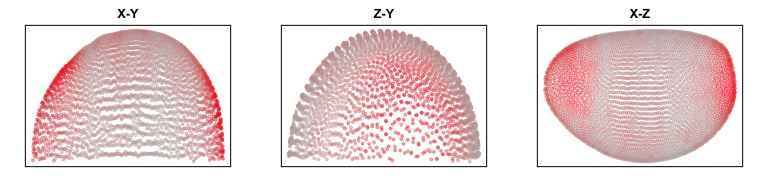
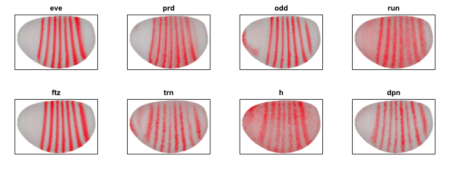
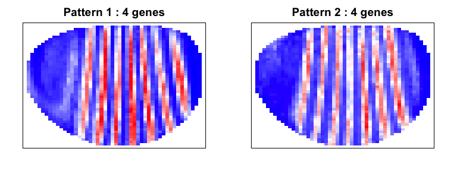
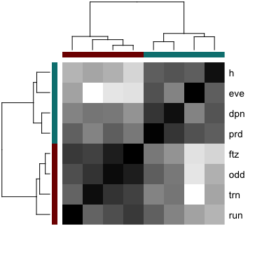

    library(MERINGUE)

In this vignette, we will walk through an analysis of spatial gene
expression data for the drosophila embryo from the Berkeley Drosophila
Transcription Network Project. Notably, 3D spatial coordinates are
available for this dataset, allowing us to analyze beyond a single plane
or tissue section.

    data("drosophila")
    pos <- drosophila$pos
    gexp <- drosophila$mat

    par(mfrow=c(1,3), mar=rep(2,4))
    g <- 'apt'
    plotEmbedding(pos[,c(1,2)], col=gexp[g,], main='X-Y')
    plotEmbedding(pos[,c(3,2)], col=gexp[g,], main='Z-Y')
    plotEmbedding(pos[,c(1,3)], col=gexp[g,], main='X-Z')

We can consider the 3D coordinates in our construction of neighbor
relationships.

    N <- getSpatialNeighbors(pos, filterDist = 10, verbose=TRUE)

    ## Filtering by distance: 10...

    ## Binarizing adjacency weight matrix ...

    ## Done!

Optionally, this 3D neighbor network can be visualized using RGL, a 3D
real-time rendering system for R. WARNING: there will be approximately
25,500 edges to draw and thus will take a significant amount of time if
rendered to your screen (for example using X11). We recommend drawing to
file.

    ## plot
    require(rgl)
    MERINGUE:::plotNetwork3D(pos, N, size=1)
    ## save plot
    rgl.snapshot(paste0(dir(), 'neighbors_3D-flat.png'))

In this particular case, all 84 genes were chosen for their known
spatial patterning. We can double check that they all indeed show up as
significantly spatially variable.

    ## analyze
    results <- getSpatialPatterns(gexp, N)
    filter <- filterSpatialPatterns(mat = gexp, 
                                    I = results, 
                                    w = N,
                                    alpha = 0.05,
                                    details = TRUE, 
                                    minPercentCells = 0.05)

    ## Number of significantly autocorrelated genes: 84

    ## ...driven by > 151.75 cells: 84

    print(head(filter))

    ##          observed      expected          sd p.value p.adj minPercentCells
    ## aay     0.9093090 -0.0003295979 0.008910810       0     0      0.20790774
    ## Ama     0.9579342 -0.0003295979 0.008933794       0     0      0.53476112
    ## Ance    0.8862914 -0.0003295979 0.008894401       0     0      0.07710049
    ## Antp    0.8450446 -0.0003295979 0.008918188       0     0      0.19868204
    ## apt     0.9343848 -0.0003295979 0.008930957       0     0      0.31070840
    ## Blimp.1 0.8375291 -0.0003295979 0.008932513       0     0      0.40988468

To identify spatial patterns, we can restrict our analysis to a subset
of pair-rule genes for demo purposes.

    par(mfrow=c(2,4), mar=rep(2,4))
    ## pair-rule genes
    sub <- c('eve', 'prd', 'odd', 'run', 'ftz', 'trn', 'h', 'dpn')
    invisible(lapply(sub, function(g) {
      plotEmbedding(pos[,c(1,3)], 
                    col=gexp[g,], 
                    main=g)
    }))

We can use our spatial cross correlation analysis to group genes into
their primary spatial patterns.

    scc <- spatialCrossCorMatrix(gexp[sub,], N)
    method = 'ward.D'
    par(mfrow=c(1,2), mar=rep(2,4))
    ggroup <- groupSigSpatialPatterns(pos[,c(1,3)], gexp, scc,
                                        hclustMethod = method,
                                        deepSplit = 2,
                                        binSize = 50,
                                        power = 1)

    ## Patterns detected:

    ##  ..cutHeight not given, setting it to 1.71  ===>  99% of the (truncated) height range in dendro.
    ##  ..done.
    ## groups
    ## 1 2 
    ## 4 4

Indeed, we are able to distinguish 2 patterns corresponding to even and
odd pair-rule genes.

    # Look at pattern association
    gcol <- rainbow(length(levels(ggroup$groups)), v=0.5)[ggroup$groups]
    names(gcol) <- names(ggroup$groups)
    heatmap(scc[ggroup$hc$labels, ggroup$hc$labels], scale='none', 
            Colv=as.dendrogram(ggroup$hc), 
            Rowv=as.dendrogram(ggroup$hc), 
            labCol=NA,
            RowSideColors=gcol[ggroup$hc$labels],
            ColSideColors=gcol[ggroup$hc$labels],
            col=colorRampPalette(c('white', 'black'))(100)
    )

\# Additional exercises

1.  Analyze all 84 genes.
2.  Instead of analyzing the 3D spatial coordinates, analyze the 2D X-Z
    projection. How are detected spatial patterns similar or different?
