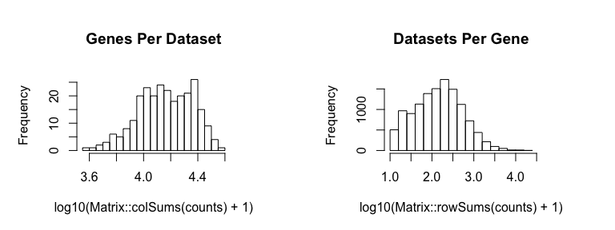
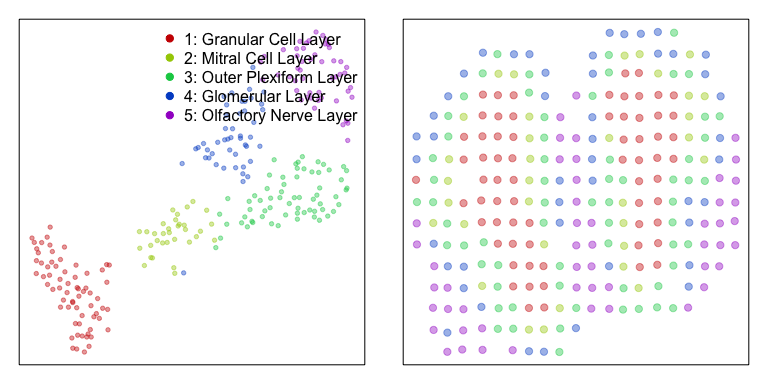
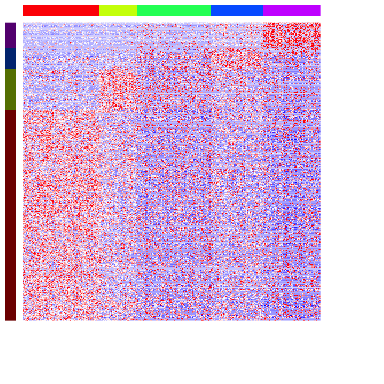
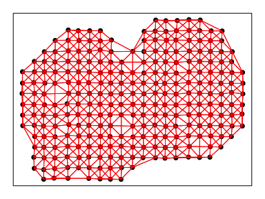
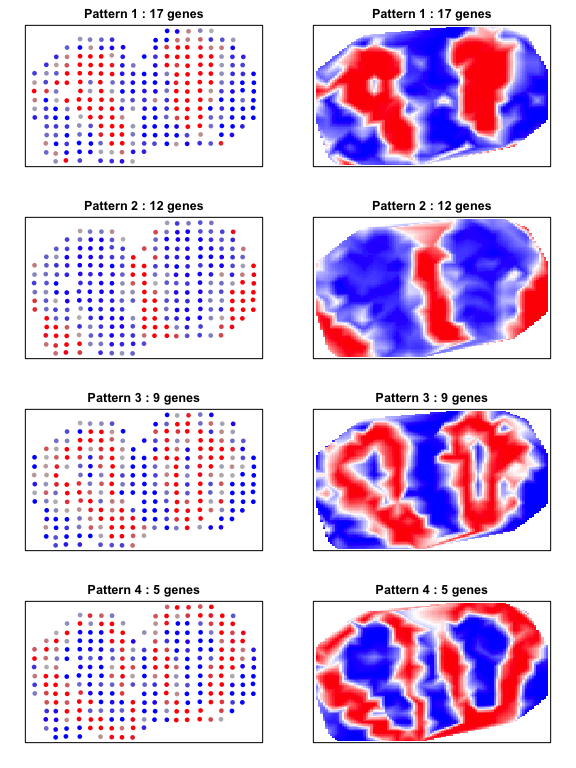
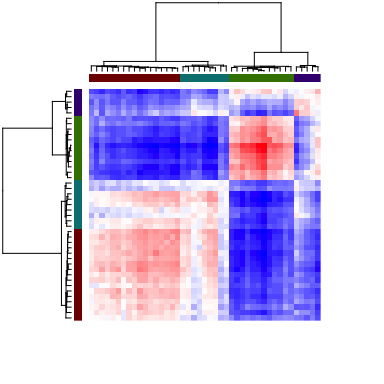
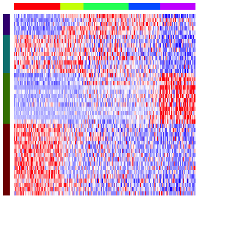
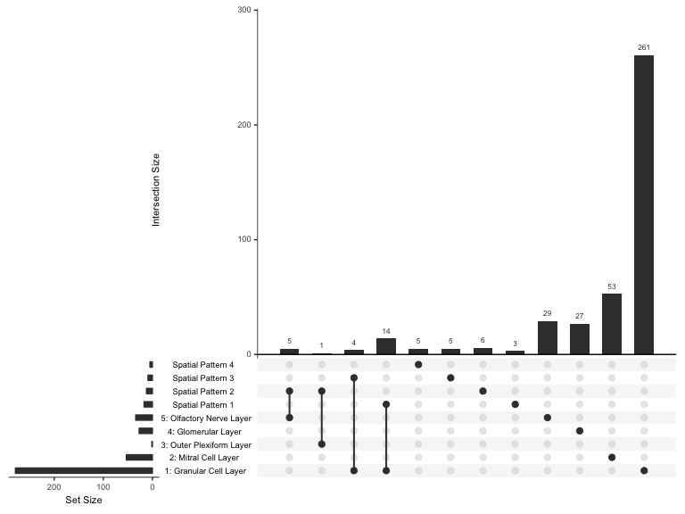
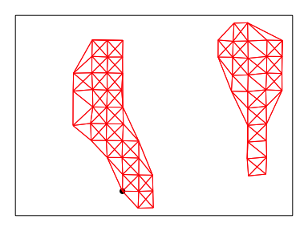

In this vignette, we will walk through an analysis of spatial
transcriptomics data for the mouse olfactory bulb (mOB). The data has
been prepared for you and is available as a part of the package. Here,
`pos` is a dataframe where each row is a voxel’s x and y positions in
space, and `cd` is a counts matrix where each column is a voxel and each
row is a gene.

``` r
library(MERingue)
data(mOB)
pos <- mOB$pos
cd <- mOB$counts
```

First, we will filter out poor voxels, defined as those with fewer than
10 counts. Likewise, we will filter out poor genes, defined as those
with fewer than 10 counts. We will then normalize to counts per million
(CPM). An appropriate normalization will be crucial to ensure that our
identified spatial patterns are not driven by technical artifacts.

``` r
# Remove poor datasets and genes
counts <- cleanCounts(counts = cd, 
                      min.reads = 10, 
                      min.lib.size = 10)
```

    ## Converting to sparse matrix ...

    ## Filtering matrix with 262 cells and 15928 genes ...

    ## Resulting matrix has 260 cells and 12292 genes



``` r
pos <- pos[colnames(counts),]

# CPM normalize
mat <- normalizeCounts(counts = counts, 
                       log=FALSE)
```

    ## Normalizing matrix with 260 cells and 12292 genes.

    ## normFactor not provided. Normalizing by library size.

    ## Using depthScale 1e+06

Spatially-unaware analysis
==========================

To better understand the value of integrating spatial information, we
will first perform a spatially-unaware analysis. Without considering the
spatial information of each voxel, we will simply perform dimensionality
reduction and graph-based clustering to identify transcriptional
subpoplations in the mOB. Note for spatial transcriptomics, a
transcriptional subpopulation in this context may reflect underlying
cell-type transcriptional differences or cell-type composition
differences among voxels. In this particular instance, the identified
transcriptional subpopulations primarily reflect understanding
cell-type. We can annotate the identified clusters based on their
proposed cell-type in accordance with the original publication. We can
then visualize the data using a tSNE embedding.

``` r
# Dimensionality reduction by PCA on log10 CPM expression values
pcs.info <- prcomp(t(log10(as.matrix(mat)+1)), center=TRUE)
nPcs <- 5
pcs <- pcs.info$x[,1:nPcs]

# 2D embedding by tSNE
library(Rtsne)
emb <- Rtsne(pcs,
                    is_distance=FALSE,
                    perplexity=30,
                    num_threads=1,
                    verbose=FALSE)$Y
rownames(emb) <- rownames(pcs)

# Graph-based cluster detection
library(igraph)
library(RANN)
k <- 30
nn <- nn2(as.matrix(pcs), k = k)
nn.df <- data.frame(from = rep(1:nrow(nn$nn.idx), k),
                      to = as.vector(nn$nn.idx),
                      weight = 1/(1 + as.vector(nn$nn.dists)))
nw.norm <- graph_from_data_frame(nn.df, directed = FALSE)
nw.norm <- simplify(nw.norm)
lc.norm <- cluster_louvain(nw.norm)
com <- as.factor(membership(lc.norm))
names(com) <- rownames(pcs)

# Manually annotate identified clusters with cell-types
annot <- as.character(com); names(annot) <- names(com)
annot[com==4] <- '1: Granular Cell Layer'
annot[com==1] <- '2: Mitral Cell Layer'
annot[com==5] <- '3: Outer Plexiform Layer'
annot[com==2] <- '4: Glomerular Layer'
annot[com==3] <- '5: Olfactory Nerve Layer'
annot <- as.factor(annot)

# Plot
par(mfrow=c(1,2), mar=rep(1,4))
plotEmbedding(emb, groups=annot, 
              show.legend=TRUE, xlab=NA, ylab=NA)
plotEmbedding(pos, groups=annot, 
              cex=1, xlab=NA, ylab=NA)
```



    ## using provided groups as a factor
    ## using provided groups as a factor

Having identified multiple transcriptionally distinct cell-types, we may
be interested in identifying marker genes for each cell-type. We can use
a Wilcox rank-test to look for genes that are significantly upregulated
in each cell-type compared to all others. For demonstration purposes, we
will restrict analysis to 2000 random genes.

``` r
# Sample 2000 genes for demo purposes only to minimize runtime
set.seed(0)
test <- sample(rownames(mat), 2000)

# Identify significantly differentially upregulated genes
# in each identified cluster by Wilcox test
dg <- getDifferentialGenes(as.matrix(mat[test,]), annot)
dg.sig <- lapply(dg, function(x) {
  x <- x[x$p.adj < 0.05,]
  x <- na.omit(x)
  x <- x[x$highest,]
  rownames(x)
})
print(lapply(dg.sig, length))
```

    ## [1] "Running differential expression with 5 clusters ... "
    ## [1] "Summarizing results ... "
    ## $`1: Granular Cell Layer`
    ## [1] 279
    ## 
    ## $`2: Mitral Cell Layer`
    ## [1] 53
    ## 
    ## $`3: Outer Plexiform Layer`
    ## [1] 1
    ## 
    ## $`4: Glomerular Layer`
    ## [1] 27
    ## 
    ## $`5: Olfactory Nerve Layer`
    ## [1] 34

Indeed, we are able to identify a number of marker genes per cell-type.
We can visualize the results as a heatmap, where each column is a voxel
with column colors denoting the cell-types, and each row is a gene with
row colors denoting which subpopulation it is a marker for.

``` r
dg.genes <- unlist(dg.sig)
ggroup <- unlist(lapply(1:length(dg.sig), function(i) { 
  rep(names(dg.sig)[i], length(dg.sig[[i]]))
}))
names(ggroup) <- dg.genes
ggroup <- factor(ggroup)

# Plot
ccol <- rainbow(length(levels(annot)))[annot]
  names(ccol) <- names(annot) # column colors
gcol <- rainbow(length(levels(ggroup)), v=0.5)[ggroup]
  names(gcol) <- names(ggroup) # row colors
m <- as.matrix(mat[dg.genes, names(sort(annot))])
m <- t(scale(t(m)))
m[m < -2.5] <- -2.5
m[m > 2.5] <- 2.5
heatmap(m, scale="none", 
          Colv=NA, Rowv=NA, labRow=NA, labCol=NA,
          ColSideColors=ccol[colnames(m)],
          RowSideColors=gcol[rownames(m)],
          col=colorRampPalette(c('blue', 'white', 'red'))(100)
)
```



Spatially-aware analysis
========================

Now, to integrate the spatial information, we will create a spatial
weight matrix. We will use a binary weighting scheme here, where two
voxels will be connected with a weight of 1 if they are mutual k-nearest
neighbors with each other, and otherwise not connected with a weight of
0.

``` r
# Get neighbor-relationships
w <- voronoiAdjacency(pos, njitter = 20, ajitter = 2.5, filterDist = 2.5)
par(mfrow=c(1,1), mar=rep(1,4))
plotNetwork(pos, w, line.power=3,
            axes=FALSE, xlab=NA, ylab=NA); box()
```



We will then assess the same set of 2000 genes for evidence of
significant spatial auto-correlation or spatial clustering.

``` r
# Identify sigificantly spatially auto-correlated genes
I <- getSpatialPatterns(mat[test,], w)
results.filter <- filterSpatialPatterns(mat = mat,
                                        I = I,
                                        w = w,
                                        adjustPv = TRUE,
                                        alpha = 0.05,
                                        minPercentCells = 0.1,
                                        verbose = TRUE)
```

    ## Number of significantly autocorrelated genes: 82

    ## ...driven by > 26 cells: 43

We anticipate that these spatially clustered genes will likely fall into
similar spatial patterns. This could be due to their inherent
co-expression within cell-types or for other biological reasons.
Therefore, we can compute a spatial cross-correlation for all gene
pairs. Genes that are spatially co-localized will be grouped into the
same spatial pattern.

``` r
# Identify primary patterns
scc <- spatialCrossCorMatrix(sigMat = as.matrix(mat[results.filter,]), 
                             w = w)
ggroup <- groupSigSpatialPatterns(pos = pos, 
                                  mat = as.matrix(mat[results.filter,]), 
                                  scc = scc, 
                                  power = 1, 
                                  hclustMethod = 'ward.D', 
                                  deepSplit = 4)
```

    ## Patterns detected:



    ##  ..cutHeight not given, setting it to 14.4  ===>  99% of the (truncated) height range in dendro.
    ##  ..done.
    ## groups
    ##  1  2  3  4 
    ## 17 12  9  5

We can visualize the spatial cross-correlation matrix to ensure that our
pattern grouping is reasonable.

``` r
# Look at pattern association
gcol <- rainbow(length(levels(ggroup$groups)), v=0.5)[ggroup$groups]
  names(gcol) <- names(ggroup$groups)
heatmap(scc[ggroup$hc$labels, ggroup$hc$labels], scale='none', 
        Colv=as.dendrogram(ggroup$hc), 
        Rowv=as.dendrogram(ggroup$hc), 
        labRow=NA, labCol=NA,
        ColSideColors=gcol[ggroup$hc$labels],
        RowSideColors=gcol[ggroup$hc$labels],
        col=colorRampPalette(c('blue', 'white', 'red'))(100)
)
```



We can also visualize these spatially clustered genes within their
identified spatial patterns as a heatmap. Again, each column is a voxel
ordered and colored by their identified cell-type from our clustering
analysis. Each row is a significantly spatially clustered gene ordered
and colored by their identified spatial pattern.

``` r
# Plot as heatmap
sp.genes <- unlist(lapply(levels(ggroup$groups), function(x) {
  names(ggroup$groups)[ggroup$groups==x]
}))
ccol <- rainbow(length(levels(annot)))[annot]
  names(ccol) <- names(annot)
m <- as.matrix(mat[sp.genes,names(sort(annot))])
m <- t(scale(t(m)))
m[m < -2.5] <- -2.5
m[m > 2.5] <- 2.5
heatmap(m, scale="none", 
          Colv=NA, Rowv=NA, labRow=NA, labCol=NA,
          ColSideColors=ccol[colnames(m)],
          RowSideColors=gcol[rownames(m)],
          col=colorRampPalette(c('blue', 'white', 'red'))(100)
)
```



Indeed, in this particular case, as cell-types in the mOB are inherently
spatially organized, we see a strong correspondence between spatially
clustered genes and the cell-type markers we identified previously.
Specifically, the spatially clustered genes in Spatial Pattern 1 to be
highly overlapping with marker genes for the Olfactory Nerve Layer.
Similarly, spatially clustered genes in Spatial Pattern 2 to be highly
overlapping with marker genes for the Granular Cell Layer. Other spatial
patterns appear to mark combinations of spatially-colocalized
cell-types.

``` r
# Compare two different types of identifying genes
diffgexp <- dg.sig
spatgexp <- lapply(levels(ggroup$groups), function(x) {
  names(ggroup$groups)[ggroup$groups==x]
})
names(spatgexp) <- paste0('Spatial Pattern ', levels(ggroup$groups))

library(UpSetR)
upset(UpSetR::fromList(c(diffgexp, spatgexp)), 
      sets=names(c(diffgexp, spatgexp)), 
      keep.order=TRUE, order.by="degree")
```



Complementary analysis: Inter-cell-type spatial heterogeneity
=============================================================

Spatial analysis can also be complementary to spatially-unaware
clustering analysis. For example, after identifying putative cell-types
by spatially-unaware clustering analysis, we may be interesting in
identifying genes that exhibit spatial clustering within this cell-type.
For demonstration purposes, we will focus on testing whether any marker
genes for the Granular Cell Layer exhibit spatial clustering within the
Granular Cell Layer.

``` r
# Restrict to just voxels corresponding to the Granular Cell Layer.
sub <- names(annot)[annot == '1: Granular Cell Layer']
w.sub <- voronoiAdjacency(pos[sub,], njitter = 20, ajitter = 2.5, filterDist = 2.5)
par(mfrow=c(1,1), mar=rep(1,4))
plotNetwork(pos[sub,], w.sub, w, 
            axes=FALSE, xlab=NA, ylab=NA); box()
```



``` r
gs <- dg.sig[['1: Granular Cell Layer']]
I.sub <- getSpatialPatterns(mat[gs, sub], w.sub)
results.filter.sub <- filterSpatialPatterns(mat = mat[gs, sub],
                                        I = I.sub,
                                        w = w.sub,
                                        adjustPv = TRUE,
                                        alpha = 0.05,
                                        minPercentCells = 0.1,
                                        verbose = TRUE)
```

    ## Number of significantly autocorrelated genes: 0

    ## ...driven by > 6.7 cells: 0

In this case, we do not identify any additional aspects of spatial
heterogeneity within this cell-type.
