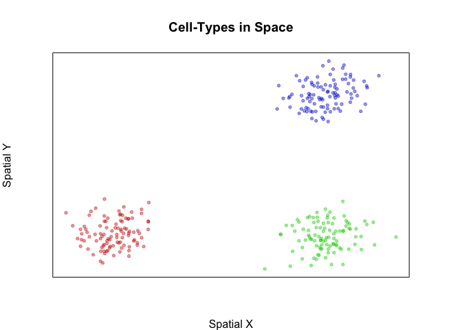
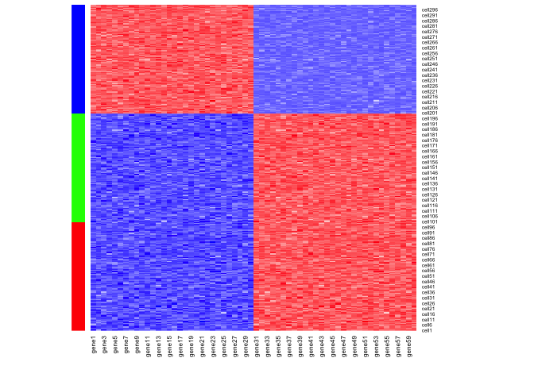
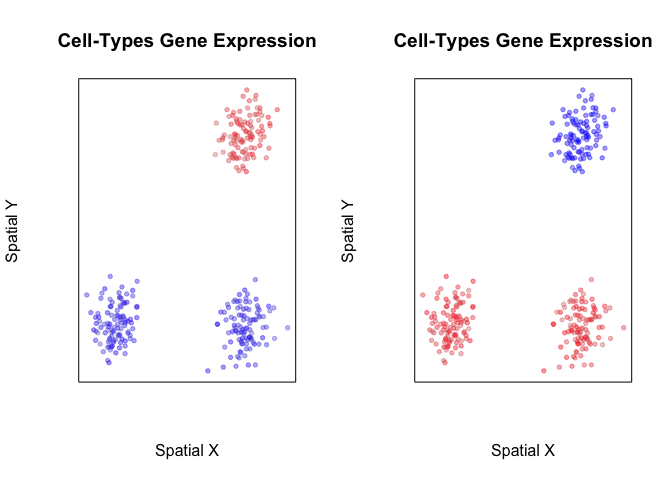
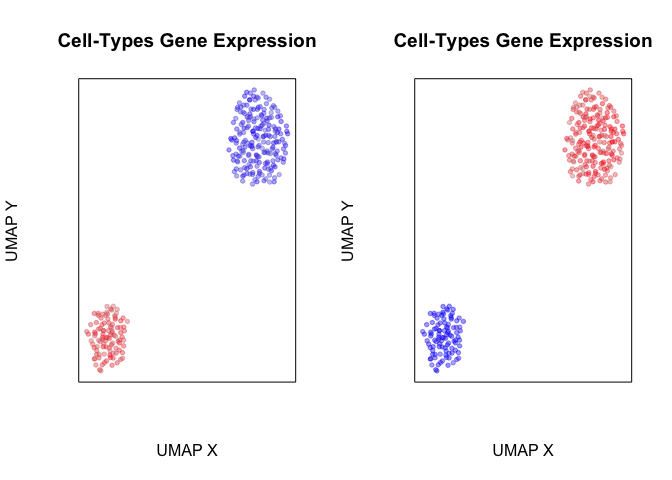
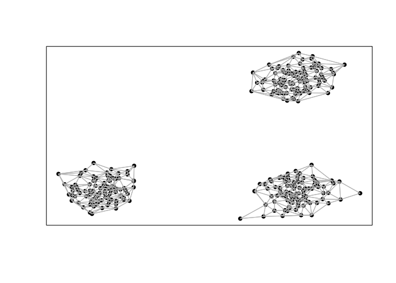
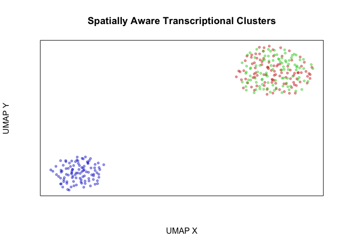

Introduction
============

The spatial organization and positioning of cells play important roles
in shaping cellular identities. In a variety of biological systems (from
the fly embryo to the mammalian brain), we have seen how such spatial
distinct organization is reflected in the cellular transcriptome. Thus,
we generally expect unsupervised clustering based on transcriptional
profiles alone to recover spatially organized cell populations. However,
what if we take into consideration the spatial positioning in additional
to transcriptional profiles in our identication of cellular clusters?
Would this allow us to resolve more subtly transcriptionally different
but spatially distinct cellular subpopulations? In this vignette, we
will explore the utility of this spatially-informed transcriptional
clustering using simulated examples.

Simulation
==========

First, let’s simulate 3 spatially distinct groups of cells. Each group
will have 300 cells that are spatially positioned in distinct groups. We
will further color these cells by their groups.

    library(MERINGUE)
    par(mfrow=c(1,1), mar=rep(4,4))

    ## simulate 3 spatially but 2 transcriptionally distinct groups
    N <- 300
    ## Three spatially distinct groups
    pos1 <- cbind(rnorm(N/3), rnorm(N/3))
    pos2 <- cbind(rnorm(N/3, 10), rnorm(N/3))
    pos3 <- cbind(rnorm(N/3, 10), rnorm(N/3, 10))
    pos <- rbind(rbind(pos1, pos2), pos3)
    group <- c(rep(1, N/3), rep(2, N/3), rep(3, N/3))
    names(group) <- rownames(pos) <- paste0('cell', 1:N)
    plotEmbedding(pos, groups=group, main='Cell-Types in Space', xlab='Spatial X', ylab='Spatial Y')

Now, let’s simulate a situation where two of these groups of cells are
transcriptionally identical. We will have 30 genes that are upregulated
in the blue group of cells compared to the green and red cells and 60
genes that are upregulated in the green and red cells relative to the
blue cells. But there are no significant transcriptional differences
between green and red cells.

    M <- 30
    ## But two are transcriptionally identical
    pcs12 <- matrix(rnorm(N*2/3*M), N*2/3, M)
    pcs3 <- matrix(rnorm(N*1/3*M, 10), N*1/3, M)
    pcs <- rbind(pcs12, pcs3)
    pcs <- cbind(pcs, abs(10-pcs))
    colnames(pcs) <- paste0('gene', 1:ncol(pcs))
    rownames(pcs) <- rownames(pos)
    heatmap(pcs, scale="none", Rowv = NA, Colv=NA,
            RowSideColors=MERINGUE:::fac2col(group),
            col=colorRampPalette(c('blue', 'white', 'red'))(100))

Indeed, when we visualize the expression of these genes in space, we can
see that they mark either only the cells in the blue group or cells in
both the red and green groups.

    par(mfrow=c(1,2))
    plotEmbedding(pos, colors=scale(pcs[,1])[,1],
                  main='Cell-Types Gene Expression', xlab='Spatial X', ylab='Spatial Y')
    plotEmbedding(pos, colors=scale(pcs[,50])[,1],
                  main='Cell-Types Gene Expression', xlab='Spatial X', ylab='Spatial Y')

So what happens when we perform transcriptome-based dimensionality
reduction with UMAP? Expectedly, we identify two transcriptionally
distinct clusters of cells.

    ######### See if we can integrate spatial information in cluster detection
    par(mfrow=c(1,2))
    library(uwot)
    emb <- umap(pcs, min_dist = 0.5)
    rownames(emb) <- rownames(pcs)
    plotEmbedding(emb, col=scale(pcs[,1])[,1], 
                  main='Cell-Types Gene Expression', xlab='UMAP X', ylab='UMAP Y')
    plotEmbedding(emb, col=scale(pcs[,50])[,1],
                  main='Cell-Types Gene Expression', xlab='UMAP X', ylab='UMAP Y')

Likewise, when we perform transcriptional-based clustering, we identify
the two transcriptionally distinct clusters of cells.

    ## First, with standard spatially-unaware cluster detection
    par(mfrow=c(1,2))
    com <- getClusters(pcs, k=50)
    plotEmbedding(pos, groups=com, main='Transcriptional Clusters', xlab='Spatial X', ylab='Spatial Y')
    plotEmbedding(emb, groups=com, main='Transcriptional Clusters', xlab='UMAP X', ylab='UMAP Y')

However, given that two of these groups of cells are spatially distinct,
perhaps we would like to integrate the spatial information in order to
tease them apart. Briefly, as in expression-based clustering, we first
construct a neighbor graph where nodes are cells and nodes are connected
with an edge if the represented cells that are within the k-most
transcriptionally similar cells. To integrate spatial information, we
then weigh the edges of this transcriptionally defined graph by the
density agnostic distance between two cells in the adjacency
representation W. In this manner, cells that are transcriptionally
similar AND also spatially proximal in space will be given greater
consideration in downstream graph-based community detection for
clustering. We find such a graph-based weighting approach to be more
stable than directly incorporating spatial positioning information in
defining the distance between cells in the initial neighbor graph
construction.

    W <- getSpatialNeighbors(pos, filterDist = 2)
    plotNetwork(pos, W)

    com2 <- getSpatiallyInformedClusters(pcs, W=W, k=50)
    table(com2)
    plotEmbedding(pos, groups=com2, main='Spatially Aware Transcriptional Clusters', xlab='Spatial X', ylab='Spatial Y')

    plotEmbedding(emb, groups=com2, main='Spatially Aware Transcriptional Clusters', xlab='UMAP X', ylab='UMAP Y')

    ## com2
    ##   1   2   3 
    ## 100 100 100

We thus show how incorporation of spatial information may help us
resolve spatially distinct but transcriptionally similar cellular
subpopulations. In real biology however, bi-lateral symmetry and other
organismal symmetries may result in transcriptionally homogeneous but
spatially distinct organization of the same cell-type. In such a case,
we may not want to consider these as different subpopulations. Indeed,
there are no statistically significant differentially expressed genes
between our two identified transcriptionally homogeneous but spatially
distinct groups of cells.

    ## what's different between our spatially aware and unaware clustering
    print(table(com, com2))
    ## try to identify subtly differentially expressed genes
    vi <- com2 %in% c(1,2)
    cols <- factor(com2[vi])
    diffgexp <- getDifferentialGenes(t(pcs[vi,]), cols)

    ## Warning in getDifferentialGenes(t(pcs[vi, ]), cols): NaNs produced

    sigdiffgexp <- sapply(diffgexp, function(x) sum(x$p.adj < 0.05))
    sigdiffgexp

    ##    com2
    ## com   1   2   3
    ##   1 100 100   0
    ##   2   0   0 100
    ## [1] "Running differential expression with 2 clusters ... "
    ## [1] "Summarizing results ... "
    ## 1 2 
    ## 0 0

We thus suggest that such spatially informed clustering to be
complementary to differential expression analysis, whereby identified
clusters of spatially distinct cells should be analyzed for
significantly differentially expressed genes to ensure the presence of
significant, likely subtle, transcriptional differences.
