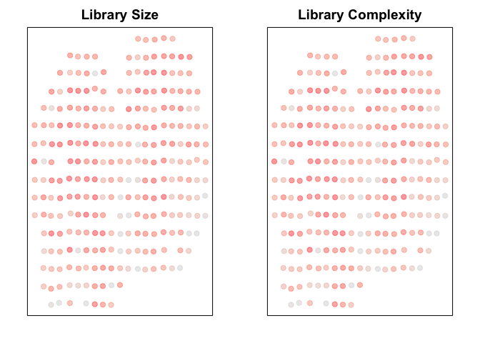
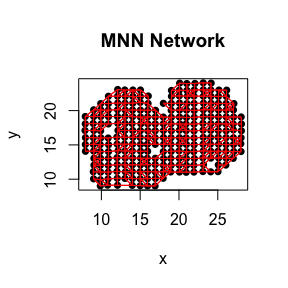
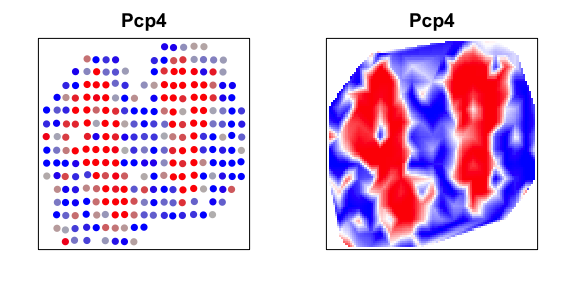
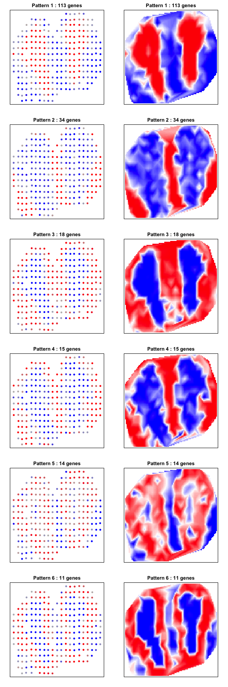

In this vignette, we will walk through an analysis of spatial
transcriptomics data for the mouse olfactory bulb. The data has been
prepared for you and is available as a part of the package.

``` r
library(MERingue)
library(Matrix)

## load mOB data
data(cd)
data(pos)

cd <- cd[,rownames(pos)]
counts <- cleanCounts(cd, min.reads=100)
```

    ## Converting to sparse matrix ...

    ## Filtering matrix with 260 cells and 16218 genes ...

    ## Resulting matrix has 260 cells and 8999 genes

``` r
mat <- normalizeCounts(counts)
```

    ## Normalizing matrix with 260 cells and 8999 genes.

    ## normFactor not provided. Normalizing by library size.

    ## Using depthScale 1e+06 and log transforming with pseudocount 1.

``` r
par(mfrow=c(1,2), mar=rep(2,4))
plotEmbedding(pos, colors=colSums(mat), cex=1, main='Library Size')
```

    ## treating colors as a gradient with zlim: 9472.281 13665.91

``` r
plotEmbedding(pos, colors=colSums(mat>0), cex=1, main='Library Complexity')
```

    ## treating colors as a gradient with zlim: 4293.95 7258.3



We will define voxels as neighbors if they are mutual nearest neighbors
in space with k=6.

``` r
## get neighbor relationship
w <- getSpatialWeights(pos, k=6)
par(mfrow=c(1,1))
plotNetwork(pos, w, main='MNN Network')
```



We can calculate the spatial autocorrelation for all genes.

``` r
## calculate spatial autocorrelation
start <- Sys.time()
I <- getSpatialPatterns(mat, w, verbose=TRUE)
end <- Sys.time()
message(paste0(nrow(mat), ' genes analyzed in ', difftime(end, start, units='mins'), ' minutes.'))
```

    ## 8999 genes analyzed in 0.129575165112813 minutes.

``` r
print(head(I))
```

    ##             observed     expected         sd    p.value p.adj
    ## Nrf1     0.027974962 -0.003861004 0.04237486 0.22623795     1
    ## Zbtb5    0.068543631 -0.003861004 0.04237367 0.04375164     1
    ## Ccnl1   -0.004192480 -0.003861004 0.04226995 0.50312842     1
    ## Lrrfip1  0.013495030 -0.003861004 0.04237274 0.34104832     1
    ## Bbs1    -0.055954344 -0.003861004 0.04235772 0.89062202     1
    ## Lix1    -0.002823449 -0.003861004 0.04172607 0.49008098     1

We want to focus on significantly autocorrelated (adjusted p-value &lt;
0.05) driven by more than 5% of cells.

``` r
## filter for patterns driven by more than 5% of cels
results.filter <- filterSpatialPatterns(mat = mat,
                                        I = I,
                                        adjustPv = TRUE,
                                        alpha = 0.05,
                                        minPercentCells = 0.05,
                                        verbose = TRUE)
```

    ## Number of significantly autocorrelated genes: 236

    ## ...driven by > 13 cells: 205

``` r
print(head(I[results.filter,]))
```

    ##         observed     expected         sd      p.value        p.adj
    ## Eef1a1 0.2754695 -0.003861004 0.04219460 1.795342e-11 1.604676e-07
    ## Sh3gl2 0.1746105 -0.003861004 0.04026880 4.668046e-06 4.094810e-02
    ## Pmepa1 0.1821270 -0.003861004 0.04208918 4.960153e-06 4.350054e-02
    ## Oxct1  0.2351766 -0.003861004 0.03997861 1.121605e-09 9.992377e-06
    ## Pcp4   0.4858612 -0.003861004 0.04226883 0.000000e+00 0.000000e+00
    ## Apc    0.3975743 -0.003861004 0.04199669 0.000000e+00 0.000000e+00

We can visualize each gene individually.

``` r
I.final <- I[results.filter,]
I.final <- I.final[order(I.final$p.value, decreasing=FALSE),]
par(mfrow=c(1,2), mar=rep(2,4))
invisible(interpolate(pos, mat[rownames(I.final)[1],], main=rownames(I.final)[1]))
```



Or group them into prominant patterns based on spatial
cross-correlation.

``` r
## spatial cross correlation to cluster genes
scc <- spatialCrossCorMatrix(as.matrix(mat[results.filter,]), w)
d <- as.dist((-scc - min(-scc))) ## convert to distance
```

``` r
ggroup <- groupSigSpatialPatterns(pos=pos, 
                                  mat=as.matrix(mat[results.filter, ]), 
                                  d=d,
                                  minClusterSize=5,
                                  plot=TRUE)
```

    ##  ..cutHeight not given, setting it to 2.39  ===>  99% of the (truncated) height range in dendro.
    ##  ..done.

    ## Patterns detected:

    ## groups
    ##   1   2   3   4   5   6 
    ## 113  34  18  15  14  11


